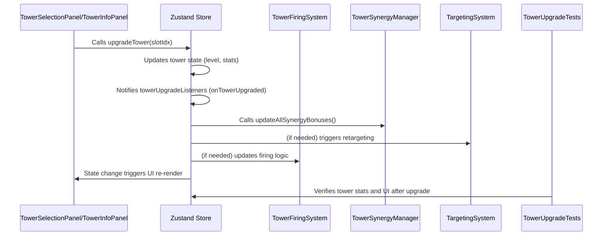

# Shooter Tower Defense Game

A hybrid shooter and tower defense game built with React, TypeScript, and the Canvas API.

## Overview (English)

This game mixes fast-paced shooting with classic tower defense strategy. Build and upgrade towers while directly attacking waves of enemies. Earn gold from defeated foes to buy weapon upgrades and stronger defenses.

## Genel Bakış (Türkçe)

Bu oyun, hızlı tempolu nişancı mekaniğini geleneksel kule savunması ile birleştirir. Düşman dalgalarını püskürtmek için kuleler inşa edip yükseltirken aynı zamanda doğrudan ateş ederek savaşırsınız. Yenilen düşmanlardan elde edilen altın ile silah ve savunmalarınızı geliştirebilirsiniz.

## Features

- Player-controlled shooting mechanics
- Tower defense elements
- Wave-based enemy spawning
- Weapon upgrade system
- Gold economy
- Tower placement and upgrades
- Towers can be destroyed and rebuilt
- Bullet hits trigger a fire effect
- **Dynamic Tower Placement**: Build towers in circular formations around the battlefield
- **Tower Relocation**: Drag and drop attacking towers to empty slots during gameplay for strategic repositioning
- **Continuous Enemy Spawning**: Enemies spawn continuously throughout each wave
- **Upgrade System**: Upgrade towers through 25 levels with unique abilities
- **Economy System**: Build resource extractors and manage gold income
- **Mine System**: Deploy and manage defensive mines
- **Wall System**: Build walls and defensive structures
- **Energy Management**: Strategic resource management for actions

## Tower Relocation System

The game now features a dynamic tower relocation system that allows you to move your attacking towers during gameplay:

### How to Use
1. **Start a game** and build some attacking towers
2. **Click and drag** any attacking tower (not economy towers) 
3. **Drag to an empty, unlocked slot** - it will highlight in green when valid
4. **Release** to complete the relocation

### Requirements
- **Energy Cost**: 15 energy per relocation
- **Cooldown**: 5 seconds between relocations per tower
- **Valid Targets**: Only empty, unlocked tower slots
- **Tower Types**: Only attacking towers can be relocated (economy towers cannot be moved)

### Strategic Benefits
- **Adapt to enemy paths**: Move towers to better intercept enemies
- **Optimize coverage**: Reposition towers for maximum range efficiency  
- **React to threats**: Quickly relocate defenses to counter specific enemy types
- **Experiment with formations**: Try different tower arrangements mid-battle

## Technologies Used

- React 18+
- TypeScript
- Canvas API
- Zustand for state management

## Getting Started

1. Clone the repository
2. Install dependencies:
   ```bash
   npm install
   ```
3. Start the development server:
   ```bash
   npm run dev
   ```

## Game Controls

- Mouse: Aim and shoot
- Click on tower spots to build/upgrade towers
- Gold is automatically spent on weapon upgrades
- **Right-click**: Access context menu for tile actions
- **P**: Pause/resume during preparation phase
- **F**: Skip preparation countdown
- **R/F5**: Reset game

## Project Structure

```
/src
  /components      # React components
  /logic          # Game logic and systems
  /models         # TypeScript interfaces and types
  /utils          # Utility functions and constants
  /assets         # Game assets
```

## Development

The game is built using a component-based architecture with the following key systems:

- Game loop and rendering
- Enemy spawning and movement
- Collision detection
- Tower management
- Weapon systems
- Economy system

## License

This project is licensed under the MIT License. See the [LICENSE](LICENSE) file for details.

# Tower Upgrade Flow: Sequence Diagram



## Why is this upgrade flow necessary?

This sequence ensures that **tower upgrades are immediately and consistently reflected across all game systems**:

- **Immediate State Update:** When the UI triggers an upgrade, the store updates the tower's level and stats atomically.
- **Event-Driven Synchronization:** The store notifies all registered listeners (`towerUpgradeListeners`), so systems like synergy, targeting, and firing logic can react instantly.
- **Synergy & Targeting Consistency:** Synergy bonuses and targeting logic are recalculated right after the upgrade, preventing any desynchronization or stale state.
- **UI Reactivity:** The UI re-renders automatically in response to state changes, ensuring the player always sees the correct tower stats and effects.
- **Testability:** Automated tests (e.g., `TowerUpgradeTests`) can verify that upgrades propagate correctly, making the system robust against regressions.

### Importance
- **Gameplay Fairness:** Prevents situations where a tower appears upgraded in the UI but is not actually stronger in-game, or vice versa.
- **Performance:** Event-driven updates avoid unnecessary recalculations and re-renders, optimizing both CPU usage and user experience.
- **Maintainability:** Centralizing upgrade logic and using listeners makes it easy to extend or modify upgrade effects without breaking other systems.
- **Testing:** The clear, event-driven flow enables reliable automated tests, which are essential for preventing bugs as the game evolves.

> **In summary:** This flow is critical for a responsive, bug-free, and maintainable tower defense game, ensuring upgrades are always in sync across gameplay, visuals, and tests.
